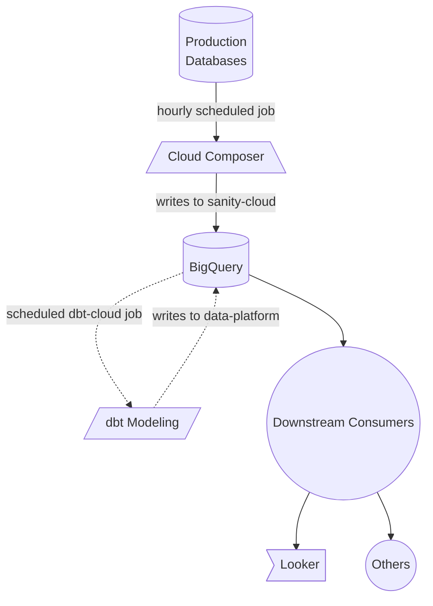
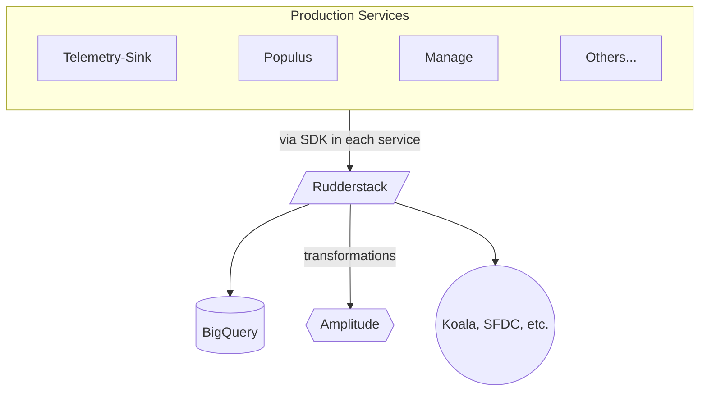

# Overview of Our Data Stack

## Data Engineering

### Incoming production data

Event data generally follows 2 paths: ETLs (extract-transform-load jobs) and Event streams.

ELTs are primarily a pull-based operation orchestrated by our managed Airflow runner (Cloud Composer) in the `data-platform` project. The job to ETL production data has access to the databases of these services and queries against them directly. However, there are some production services that write directly to the `sanity-cloud` project’s BQ instance via a cronjob.

Event streams are Rudderstack Go/Node/Browser SDKs that send their payloads to Ruddertstack itself where they can be transformed and pushed to several services. We send these payloads to the `sanity-cloud.rudderstack_data` dataset and they are often used by the dbt modeling jobs. One example of this is the Telemetry-Sink service which receives studio telemetry events and forwards them to BQ and Amplitude.

The https://github.com/sanity-io/data-automation-monorepo is the location of the Airflow DAG configuration files as well as the containers that perform the data workloads.

The https://github.com/sanity-io/rudderstack-transformations repo holds the transformation functions that run for specific destinations such as Amplitude.

## Ingestion

### Rudderstack

We use [Rudderstack](https://www.rudderstack.com/) as our customer data routing platform. It has several SDKs that backend/frontend services can use to route event data from those services through Rudderstack to a destination. All Production/Staging route to a production or staging dataset in BigQuery, either `sanity-cloud.rudderstack_data` or `sanity-cloud.rudderstack_data_staging` and many others also extend to other sources such as Koala or Amplitude. These destinations can also transform the payload content of those events to fit the destination’s expectations so they can be ingested properly.

### BigQuery

The data warehouse is hosted on BigQuery in two different projects.

**Sanity** (sanity-cloud) - the project where source data from rudderstack are recorded. Queries run in this project are billed on demand, and so should be avoided if possible.

**data-platform** - the main project for the data warehouse. The ETL pipeline via dbt is written to this project, and all final datasets are found here. This project is billed with a flat fee, so you don't need to worry about how long/how much data the query uses. You can query tables in `sanity-cloud` within this project and it will still be billed under the flat fee project.

### dbt

We use [dbt](https://hd827.us1.dbt.com/home) to clean and transform data. Our dbt project is found in the [sanity-io/analytics-dbt-sanity](https://github.com/sanity-io/analytics-dbt-sanity) repo. Final production datasets are written to the `dbt_production` schema in the `data-platform` BigQuery project.

### Looker

[Looker](https://sanityio.cloud.looker.com/browse) is our business intelligence tool, using it for dashboards and reports. The analytics team builds out dashboards for stakeholders, and a select number of people outside the analytics team are also able to make their own dashboards. The certified folder in the shared space in Looker contains dashboards that the analytics team has signed off on as correct and reliable. Looker can query anything in BigQuery, but requires a Looker developer (someone on the analytics team) to build out an Explore for the table.

There's more information about getting started with Looker on [Sanity Home](https://home.sanity.team/guide/getting-started-with-looker).

### Amplitude

[Amplitude](https://app.amplitude.com/analytics/sanity-io/home) is used to analyze productt data. Amplitude works by ingesting events either via Rudderstack or another service, and is able to build common product data graphs and dashboards. Amplitude does not have access to BigQuery, and so any data we want to appear in Amplitude must be sent to Amplitude.

Generally, all event-based data should be sent to Rudderstack, which can route it to both BigQuery (and therefore Looker) and Amplitude, making it available in both tools. Amplitude is good at tracking straightforward user usage metrics, including user journeys and retention. Looker is able to pull in additional context from other sources in BigQuery, such has the number of eligible projects that could use the feature, as well as properly aggregate to project- and organization-level usage metrics.
